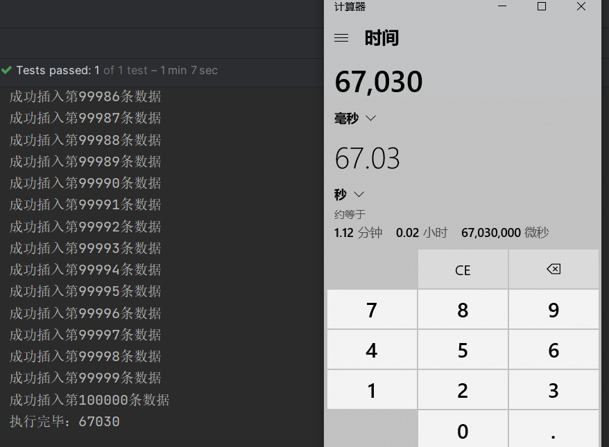
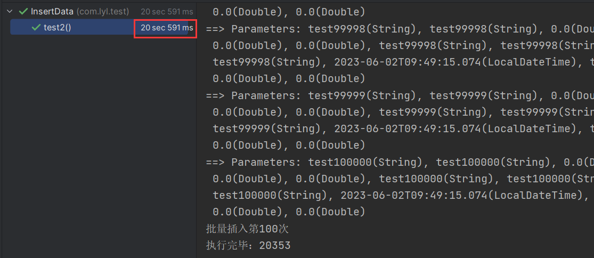
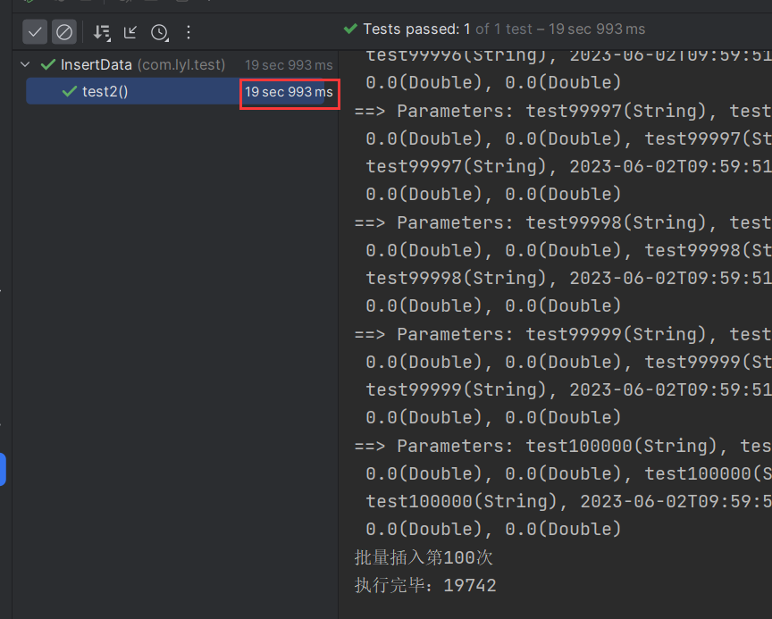
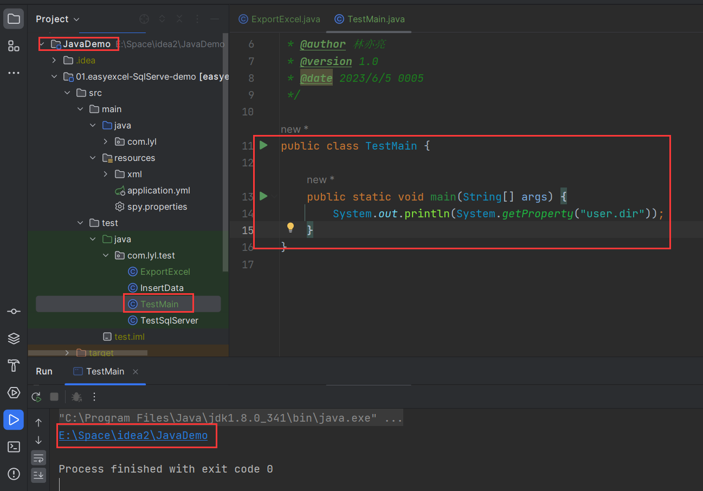
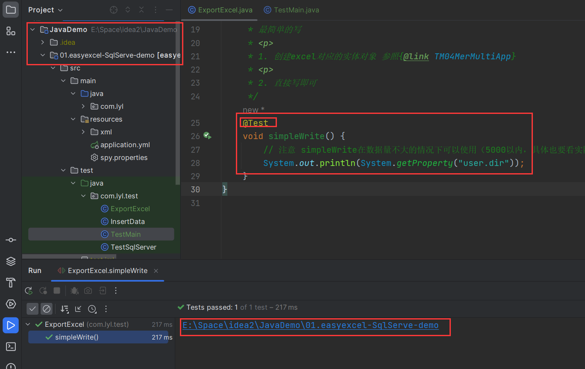
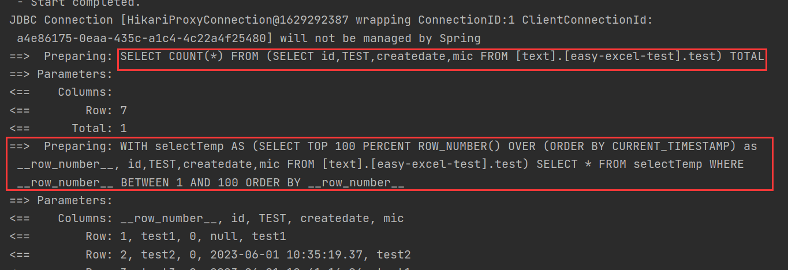
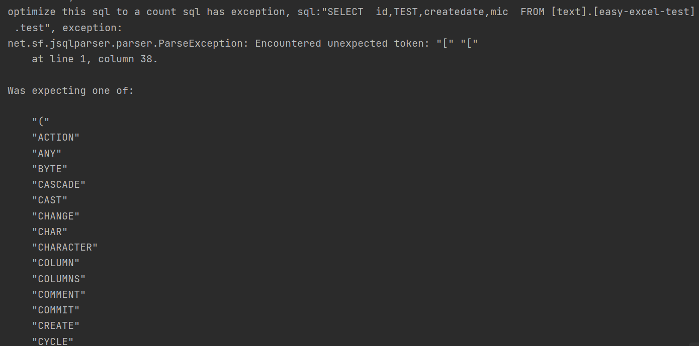
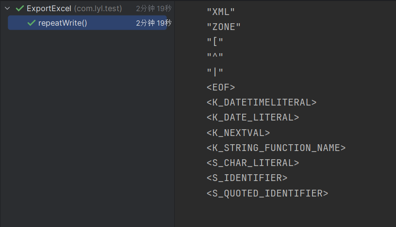
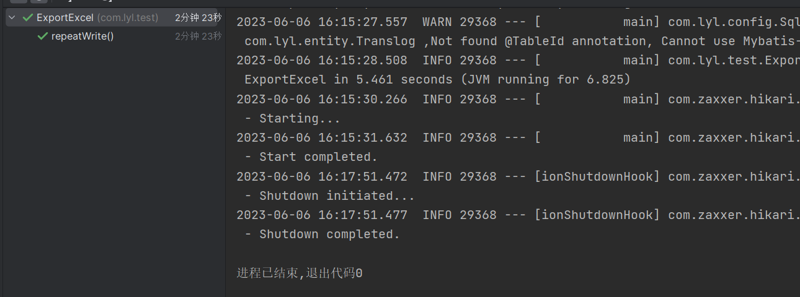

# 1.批量插入百万数据

因为测试Excel需要准备数据，所以使用Mybatisplus的批量插入。然后又想对插入进行调优，因为Excel数据量大的时候，Java跑起来是真的慢。

## 上网查资料

https://blog.csdn.net/m0_71777195/article/details/130862000

标题是mybatis调优，用的又是mybatisplus

总结：

1.一条一条插入最慢

2.使用mybatisplus的批量插入速度快一倍

3.使用jdbc原生的executeBatch ，速度和mybatisplus的批量插入差不多，mybatisplus底层应该也是使用的这个方法

4.使用拼接sql的方式进行插入（可以是原生的，也可以用mybatisplus的自定义SQL，使用foreach拼接values），即使用sql语句的批量插入，如下

~~~sql
insert into {tableName} values(v1,v2...),(v1,v2...)...
~~~

性能最nb，比批量插入快了二十几倍

综上得出拼接SQL实现批量的速度最快，然后查找是否有不需手动拼接sql的方式。

通过在连接数据库url中添加一个参数：

~~~yaml
 url: jdbc:sqlserver://localhost;DatabaseName=text;rewriteBatchedStatements=true
~~~

添加参数之后，重新测试了mybatisplus的批量插入和jdbc的executeBatch ，速度都提升至和拼接sql差不多

通过调试发现，改参数顾名思义，就是重写批量插入，就是对于插入而言，将一批插入转换为拼接sql的形式

那为什么不默认开启呢？原因如下：

* 如果批量语句中的某些语句失败，则默认重写会导致所有语句都失败。

* 批量语句的某些语句参数不一样，则默认重写会使得查询缓存未命中。

实际考虑是否对项目有影响来决定是否要开启该参数

## 实操

mybatisplus+SQLserver

这里是为了测试做数据准备，所以开启该参数没什么影响

这里又学到一个spring的工具类StopWatch，可以用来计时

~~~java
		StopWatch stopWatch = new StopWatch();
		stopWatch.start("开始");
		//执行
		System.out.println("执行完毕："+stopWatch.getTotalTimeMillis());
~~~

1.未开重写sql参数，单线程逐条插入10万条数据

表字段就不贴了，表一共是102个字段，必填的下面的18个字段

~~~java
	@Test
	void test1() {
		StopWatch stopWatch = new StopWatch();
		stopWatch.start("开始");
		for (int i = 1; i <= 100000; i++) {
			TM04MerMultiApp tm04MerMultiApp = new TM04MerMultiApp();
			tm04MerMultiApp.setId("test" + i);
			tm04MerMultiApp.setCustomerId("test" + i);
			tm04MerMultiApp.setIsMain(0d);
			tm04MerMultiApp.setRegisterWay(0d);
			tm04MerMultiApp.setStatus(0d);
			tm04MerMultiApp.setHeadQuartersFlag(0d);
			tm04MerMultiApp.setIsTradeProcess(0d);
			tm04MerMultiApp.setIsSettlement(0d);
			tm04MerMultiApp.setAcquirerNo("test" + i);
			tm04MerMultiApp.setCreater("test" + i);
			tm04MerMultiApp.setCreateDate(LocalDateTime.now());
			tm04MerMultiApp.setLastModifier("test" + i);
			tm04MerMultiApp.setLastModifyDate(LocalDateTime.now());
			tm04MerMultiApp.setBranch("test" + i);
			tm04MerMultiApp.setProvinceBranch("test" + i);
			tm04MerMultiApp.setIsDelete("0");
			tm04MerMultiApp.setAppCategory(0d);
			tm04MerMultiApp.setAppNo(0d);

			boolean j = tm04MerMultiAppService.save(tm04MerMultiApp);
			if (j) {
				System.out.println("成功插入第" + i + "条数据");
			} else {
				System.out.println("第" + i + "条数据插入失败");
			}
		}
		stopWatch.stop();
		System.out.println("执行完毕：" + stopWatch.getTotalTimeMillis());
	}
~~~

多次测试均在1分钟左右

之前还看到过一篇文章是对mysql逐条插入30万条数据，他测试逐条插入用了4个多小时。。。不太理解，而且他测试的表只有3个字段，是电脑配置问题还是说mybatisplus有优化，但是我开sql显示时发现也是一条一条sql执行的，不太清楚，跳过。

2.未开重写sql参数，单线程批量插入10万条数据

执行插入前清除数据

~~~sql
TRUNCATE TABLE {tableName}
~~~

每1千条数据执行一次saveBatch

~~~java
	@Test
	void test2() {
		StopWatch stopWatch = new StopWatch();
		stopWatch.start("开始");
		ArrayList<TM04MerMultiApp> list = new ArrayList<>();
		for (int i = 1; i <= 100000; i++) {
			TM04MerMultiApp tm04MerMultiApp = new TM04MerMultiApp();
			tm04MerMultiApp.setId("test" + i);
			tm04MerMultiApp.setCustomerId("test" + i);
			tm04MerMultiApp.setIsMain(0d);
			tm04MerMultiApp.setRegisterWay(0d);
			tm04MerMultiApp.setStatus(0d);
			tm04MerMultiApp.setHeadQuartersFlag(0d);
			tm04MerMultiApp.setIsTradeProcess(0d);
			tm04MerMultiApp.setIsSettlement(0d);
			tm04MerMultiApp.setAcquirerNo("test" + i);
			tm04MerMultiApp.setCreater("test" + i);
			tm04MerMultiApp.setCreateDate(LocalDateTime.now());
			tm04MerMultiApp.setLastModifier("test" + i);
			tm04MerMultiApp.setLastModifyDate(LocalDateTime.now());
			tm04MerMultiApp.setBranch("test" + i);
			tm04MerMultiApp.setProvinceBranch("test" + i);
			tm04MerMultiApp.setIsDelete("0");
			tm04MerMultiApp.setAppCategory(0d);
			tm04MerMultiApp.setAppNo(0d);

			list.add(tm04MerMultiApp);
			if (i % 1000 == 0) {
				boolean b = tm04MerMultiAppService.saveBatch(list);
				if (b) {
					System.out.println("批量插入第" + i / 1000 + "次");
				}
				list.clear();
			}
		}
		stopWatch.stop();
		System.out.println("执行完毕：" + stopWatch.getTotalTimeMillis());
	}
~~~

多次测试都是20秒，都是毫秒级不同

3.打开sql重写参数，单线程批量插入10万条数据

~~~yaml
url: jdbc:sqlserver://localhost;DatabaseName=text;rewriteBatchedStatements=true
~~~

代码同2

结果几乎一致，从打印的sql来看，一条sql语句之后都是参数，应该是mybatisplus已经对批量操作进行了优化

---重新测了有无重写sql参数的两个批量操作，发现sql语句是一样的，继续上网查资料，发现SQLserver的驱动似乎没有这个参数，后来发现AI是真的nt，昨天问它连接SQLserver的url中有没有这个参数说有，今天再问又说没有。。。

由于打印的sql语句并不是多值插入的形式，然后看了看了一下批量操作的实现，发现mybatisplus的实现是通过executeBatch分批提交。而rewriteBatchedStatements是将批量提交的sql进行sql重写，将sql重写成多值插入的形式。在网上看的文章mysql加了重写参数，saveBatch的性能都有很大提高。

只好自己写多值插入的自定义sql

xml：

~~~xml
<insert id="saveBatchTest" parameterType="java.util.List">
        insert into [text].[easy-excel-test].T_M04_MER_MULTI_APP( id, CUSTOMER_ID, IS_MAIN, REGISTER_WAY, STATUS, IS_SETTLEMENT, HEAD_QUARTERS_FLAG, IS_TRADE_PROCESS, ACQUIRER_NO, CREATER, CREATE_DATE, LAST_MODIFIER, LAST_MODIFY_DATE, BRANCH, PROVINCE_BRANCH, IS_DELETE, APP_CATEGORY, APP_NO )
        values
        <foreach collection="list" item="item" index="index" separator=",">
            ( #{item.id}, #{item.customerId}, #{item.isMain}, #{item.registerWay}, #{item.status}, #{item.isSettlement}, #{item.headQuartersFlag}, #{item.isTradeProcess}, #{item.acquirerNo}, #{item.creater}, #{item.createDate}, #{item.lastModifier}, #{item.lastModifyDate}, #{item.branch}, #{item.provinceBranch}, #{item.isDelete},#{item.appCategory}, #{item.appNo} )
        </foreach>
    </insert>
~~~

然后在mapper和service中补充方法

一开始一次拼接1000条数据时，直接报错，每次的参数不能超过2100个（这个好像是驱动做的限制），这里一条数据就有18个参数，所以只能将批量处理的条数降为100条

时间大概在16秒左右，提升并不大

然后将sql打印关了之后发现速度又有了一点提升，输出东西太多了，对性能有点影响

## 总结

rewriteBatchedStatements=true在SQLserver上没什么用。

将所有输出语句去掉，StopWatch也不用了，最终mybatisplus的批量插入耗时在14秒，自定义sql在12秒。

综合所有测试结果得出：

insert语句的多值插入正常情况下性能最好，前提应该要看单条数据需要传输的字段有几个，像我现在测试的每条数据有18个字段，导致了单次插入时不能拼接太多，这样操作的也多了。而上网查资料看到的测试基本上只有3,4个字段，他们使用多值插入的性能是远超于使用mybatisplus的批量插入的。所以追求速度的话，如果字段多的话，还是使用mybatisplus的批量插入较好，反之就用多值插入。

还有一个是mybatisplus单次批量插入时的数据量并不会影响执行的时间。

我看网上的测试使用mysql数据库时，rewriteBatchedStatements是可以将mybatisplus的批量插入转换成多值插入的，既然是转换为了多值插入，推测应该在字段过多的情况下，性能可能会追上不重写sql时的。这个就根据实际情况来考虑需不需要加了。字段少的话加个参数就可以重写sql，也省的自己去实现多值插入了。

最后是将百万数据插入到数据库，使用mybatisplus批量操作总耗时一分45秒。使用多值插入耗时也是来到了一分40秒，6。不过因为插入一百万条数据，一批次只有100条数据，控制台输出的信息有点多，性能稍微有点影响，将输出语句注释掉后再重新测试发现耗时为一分钟28秒。之前的差距为2秒左右，看来只有字段数会影响两种方法的差距，数据量并不会影响差距。

## 扩展

---发现一个不用自定义sql也可以改变SQL的方式

查找资料发现其实就是使用mybatisplus的sql注入

步骤：

创建SQL注入器

~~~java
public class SqlInjector extends DefaultSqlInjector {

	@Override
	public List<AbstractMethod> getMethodList(Class<?> mapperClass) {
		List<AbstractMethod> methodList = super.getMethodList(mapperClass);
		methodList.add(new InsertBatchSomeColumn(i -> i.getFieldFill() != FieldFill.UPDATE));
		return methodList;
	}
}
~~~

注入插件

~~~java
@Configuration
public class MybatisPlusConfig {

	@Bean
	public SqlInjector sqlInjector() {
		return new SqlInjector();
	}
}
~~~

编写一个mapper继承basemapper，注意这个mapper不要和实体类的mapper在同一个包中，如下图

 

~~~java
public interface ExtendBaseMapper<T> extends BaseMapper<T> {

	/**
	 * 批量插入
	 *
	 * @param entityList 实体列表
	 * @return 影响行数
	 */
	Integer insertBatchSomeColumn(Collection<T> entityList);
}
~~~

实体类的mapper继承上面这个mapper（这里你原来自定义的方法也要拷进来，因为service层调用了你自定义的方法）

~~~java
public interface TM04MerMultiAppMapper extends ExtendBaseMapper<TM04MerMultiApp> {

}
~~~

修改完后就可以测试了

~~~java
@Test
	void test4() {
		ArrayList<TM04MerMultiApp> list = new ArrayList<>();
		for (int i = 1; i <= 100000; i++) {
			TM04MerMultiApp tm04MerMultiApp = new TM04MerMultiApp();
			tm04MerMultiApp.setId("test" + i);
			tm04MerMultiApp.setCustomerId("test" + i);
			tm04MerMultiApp.setIsMain(0d);
			tm04MerMultiApp.setRegisterWay(0d);
			tm04MerMultiApp.setStatus(0d);
			tm04MerMultiApp.setHeadQuartersFlag(0d);
			tm04MerMultiApp.setIsTradeProcess(0d);
			tm04MerMultiApp.setIsSettlement(0d);
			tm04MerMultiApp.setAcquirerNo("test" + i);
			tm04MerMultiApp.setCreater("test" + i);
			tm04MerMultiApp.setCreateDate(LocalDateTime.now());
			tm04MerMultiApp.setLastModifier("test" + i);
			tm04MerMultiApp.setLastModifyDate(LocalDateTime.now());
			tm04MerMultiApp.setBranch("test" + i);
			tm04MerMultiApp.setProvinceBranch("test" + i);
			tm04MerMultiApp.setIsDelete("0");
			tm04MerMultiApp.setAppCategory(0d);
			tm04MerMultiApp.setAppNo(0d);

			list.add(tm04MerMultiApp);
			if (i % 20 == 0) {
				Integer j = tm04MerMultiAppMapper.insertBatchSomeColumn(list);
				if (j > 0) {
					System.out.println("批量插入第" + i / 20 + "次");
				}
				list.clear();
			}
		}
	}
~~~

这个insertBatchSomeColumn方法是解析了实体类的所有字段生成的多值插入的sql，sql是包含了所有字段的，所以我只插入18个必要字段，但是我的实体类有100个字段，他传输的参数为100个，所以我得降低单次批量插入的数据量。最后执行时间约为44秒

从这里可以发现，insertBatchSomeColumn方法的原理也是使用了多值插入，虽然不用自定义sql语句，但是他会解析所有字段，并且参数也是所有字段。可以看到传的字段多了，耗时已经超过了原来的批量操作的方法。

总结：追求速度的话，**实体类**字段少可以使用insertBatchSomeColumn来替代自定义sql，实体类字段较多但传的字段少还是得用自定义sql，传的字段多了就直接用批量操作的方法就可以了。

# 2.将百万数据导入到Excel

## System.getProperty("XXX")

用来读取JVM中的系统属性

java默认的系统变量有下面这些：

java.version:java运行时版本

java.vendor:java运行时环境供应商

java.vendor.url:java供应商url

java.home;java安装目录

java.vm.specification.version:java虚拟机规范版本

java.vm.specification.vendor:java虚拟机规范供应商

java.vm.specification.name:java虚拟机规范名称

java.vm.version:java虚拟机实现版本

java.vm.vendor:java虚拟机实现供应商

java.vm.name:java虚拟机实现名称

java.specification.version:java运行时环境规范版本

java.specification.vendor:java运行时环境规范运营商

java.specification.name:java运行时环境规范名称

java.class.version:java类格式版本

java.class.path:java类路径

java.library.path:加载库是搜索的路径列表

java.io.tmpdir:默认的临时文件路径

java.compiler:要使用的JIT编译器的路径

java.ext.dirs:一个或者多个扩展目录的路径

os.name:操作系统的名称

os.arch:操作系统的架构

os.version:操作系统的版本

file.separator:文件分隔符（在unix系统中是“/”）

path.separator:路径分隔符（在unix系统中是“:”）

line.separator:行分隔符（在unix系统中是“/n”）

user.name:用户的账户名称

user.home:用户的主目录

user.dir:用户的当前工作目录

在test中用main和@Test运行得到的工作目录不同，主目录相同

简单测试，先将100条数据写入到Excel中

~~~java
@Test
	void simpleWrite() {
		// 注意 simpleWrite在数据量不大的情况下可以使用（5000以内，具体也要看实际情况），数据量大参照 重复多次写入
		String fileName = EXCEL_OUTPUT_PATH + System.currentTimeMillis() + ".xlsx";
		EasyExcel.write(fileName, TM04MerMultiApp.class)
				.sheet("测试1")
				.doWrite(() -> {
					Page<TM04MerMultiApp> page = itm04MerMultiAppService.page(new Page<>(0, 100));
					List<TM04MerMultiApp> tm04MerMultiAppList = page.getRecords();
					System.out.println(tm04MerMultiAppList.size());
					return tm04MerMultiAppList;
				});
	}
~~~

一开始，只执行page时发现sql语句经常报错，反复调试也不行。

然后上网查资料发现在mybatisplus的config中，数据库方言不能设置为SQLserver，在调用一些方法的时候，sql语句会出错，而且越改越错，可能是不太兼容高版本的SQLserver。（逛了一圈issues，发现SQLserver各个版本都有不同的问题。。。）

~~~java
innerInterceptor.setDbType（DbType.SQL_SERVER)
~~~

数据库类型设置为SQLserver2005，要么就不设置，mybatisplus会根据驱动来选择

之后就可以正常查询到数据了，但还有几个小问题

执行的sql语句怪怪的，还会报一个sql异常，但是不影响正常查询。这个异常在issues中发现有，该问题在3.5.1后得到解决，原来的版本为3.4.1。可能sql语句的实现也可能是低版本的问题，还是使用最新版试试。

换了新版本后，想着代码生成器也有新版本，就又搞了下新版本的代码生成器，配置和旧的差不多。

重新测试后发现还是有这个错误。。。

搞不定了，是jsqlparser的问题。

## 转换器

字段在写入文件中时需要进行处理时用到。官方提供了日期、时间和自定义格式转换，日期和时间文档都有。主要是自定义格式转换。

自定义转换器类的写法：

~~~java
public class TestConverter implements Converter<String> {

    @Override
    public WriteCellData<?> convertToExcelData(String value, ExcelContentProperty contentProperty, GlobalConfiguration globalConfiguration) throws Exception {
        return new WriteCellData<>("自定义转换器：" + value);
    }
}
~~~

在实体类字段中使用：

~~~java
	@ExcelProperty(value = "描述", converter = TestConverter.class)
    private String mic;
~~~

## 开始写入

只将必填的字段写入Excel

单次写入

~~~java
// 注意 simpleWrite在数据量不大的情况下可以使用（5000以内，具体也要看实际情况），数据量大参照 重复多次写入
        String fileName = EXCEL_OUTPUT_PATH + System.currentTimeMillis() + ".xlsx";
        EasyExcel.write(fileName, M04MerMultiApp.class)
                .sheet("测试1")
                .doWrite(() -> {
                    Page<M04MerMultiApp> page = m04MerMultiAppService.page(
                            new Page<>(0, 100));
                    List<M04MerMultiApp> tm04MerMultiAppList = page.getRecords();
                    System.out.println(tm04MerMultiAppList.size());
                    return tm04MerMultiAppList;
                });
~~~

多次重复写入(写到单个或者多个Sheet)

~~~java
@Test
    void repeatWrite() {
        String fileName = EXCEL_OUTPUT_PATH + System.currentTimeMillis() + ".xlsx";
        try (ExcelWriter excelWriter = EasyExcel.write(fileName, M04MerMultiApp.class).build()) {
            // 这里注意 如果同一个sheet只要创建一次
            WriteSheet writeSheet = EasyExcel.writerSheet("sheet1").build();
            // 去调用写入,这里我调用了五次，实际使用时根据数据库分页的总的页数来
            for (int i = 0; i < 200; i++) {
                // 分页去数据库查询数据 这里可以去数据库查询每一页的数据
                List<M04MerMultiApp> data = m04MerMultiAppService.page(new Page<>(i, 5000))
                        .getRecords();
                excelWriter.write(data, writeSheet);
            }
        }
    }
~~~

耗时：2分19秒

找到了关掉jsqlparse的方法，将测试代码改成下面这样：

~~~java
				Page<M04MerMultiApp> page1 = new Page<>(i, 5000);
//这里设置了就ok了
                page1.setOptimizeCountSql(false);
                Page<M04MerMultiApp> page = m04MerMultiAppService.page(page1);
~~~

再也不会有烦人的东西了

跑多几次发现时间都在2分10秒左右

## 优化

