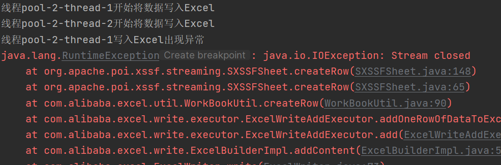

# 1.批量插入百万数据

因为测试Excel需要准备数据，所以使用Mybatisplus的批量插入。然后又想对插入进行调优，因为Excel数据量大的时候，Java跑起来是真的慢。

## 上网查资料

https://blog.csdn.net/m0_71777195/article/details/130862000

标题是mybatis调优，用的又是mybatisplus

总结：

1.一条一条插入最慢

2.使用mybatisplus的批量插入速度快一倍

3.使用jdbc原生的executeBatch ，速度和mybatisplus的批量插入差不多，mybatisplus底层应该也是使用的这个方法

4.使用拼接sql的方式进行插入（可以是原生的，也可以用mybatisplus的自定义SQL，使用foreach拼接values），即使用sql语句的批量插入，如下

~~~sql
insert into {tableName} values(v1,v2...),(v1,v2...)...
~~~

性能最nb，比批量插入快了二十几倍

综上得出拼接SQL实现批量的速度最快，然后查找是否有不需手动拼接sql的方式。

通过在连接数据库url中添加一个参数：

~~~yaml
 url: jdbc:sqlserver://localhost;DatabaseName=text;rewriteBatchedStatements=true
~~~

添加参数之后，重新测试了mybatisplus的批量插入和jdbc的executeBatch ，速度都提升至和拼接sql差不多

通过调试发现，改参数顾名思义，就是重写批量插入，就是对于插入而言，将一批插入转换为拼接sql的形式

那为什么不默认开启呢？原因如下：

* 如果批量语句中的某些语句失败，则默认重写会导致所有语句都失败。

* 批量语句的某些语句参数不一样，则默认重写会使得查询缓存未命中。

实际考虑是否对项目有影响来决定是否要开启该参数

## 实操

mybatisplus+SQLserver

这里是为了测试做数据准备，所以开启该参数没什么影响

这里又学到一个spring的工具类StopWatch，可以用来计时

~~~java
		StopWatch stopWatch = new StopWatch();
		stopWatch.start("开始");
		//执行
		System.out.println("执行完毕："+stopWatch.getTotalTimeMillis());
~~~

1.未开重写sql参数，单线程逐条插入10万条数据

表字段就不贴了，表一共是102个字段，必填的下面的18个字段

~~~java
	@Test
	void test1() {
		StopWatch stopWatch = new StopWatch();
		stopWatch.start("开始");
		for (int i = 1; i <= 100000; i++) {
			TM04MerMultiApp tm04MerMultiApp = new TM04MerMultiApp();
			tm04MerMultiApp.setId("test" + i);
			tm04MerMultiApp.setCustomerId("test" + i);
			tm04MerMultiApp.setIsMain(0d);
			tm04MerMultiApp.setRegisterWay(0d);
			tm04MerMultiApp.setStatus(0d);
			tm04MerMultiApp.setHeadQuartersFlag(0d);
			tm04MerMultiApp.setIsTradeProcess(0d);
			tm04MerMultiApp.setIsSettlement(0d);
			tm04MerMultiApp.setAcquirerNo("test" + i);
			tm04MerMultiApp.setCreater("test" + i);
			tm04MerMultiApp.setCreateDate(LocalDateTime.now());
			tm04MerMultiApp.setLastModifier("test" + i);
			tm04MerMultiApp.setLastModifyDate(LocalDateTime.now());
			tm04MerMultiApp.setBranch("test" + i);
			tm04MerMultiApp.setProvinceBranch("test" + i);
			tm04MerMultiApp.setIsDelete("0");
			tm04MerMultiApp.setAppCategory(0d);
			tm04MerMultiApp.setAppNo(0d);

			boolean j = tm04MerMultiAppService.save(tm04MerMultiApp);
			if (j) {
				System.out.println("成功插入第" + i + "条数据");
			} else {
				System.out.println("第" + i + "条数据插入失败");
			}
		}
		stopWatch.stop();
		System.out.println("执行完毕：" + stopWatch.getTotalTimeMillis());
	}
~~~

多次测试均在1分钟左右

之前还看到过一篇文章是对mysql逐条插入30万条数据，他测试逐条插入用了4个多小时。。。不太理解，而且他测试的表只有3个字段，是电脑配置问题还是说mybatisplus有优化，但是我开sql显示时发现也是一条一条sql执行的，不太清楚，跳过。

2.未开重写sql参数，单线程批量插入10万条数据

执行插入前清除数据

~~~sql
TRUNCATE TABLE {tableName}
~~~

每1千条数据执行一次saveBatch

~~~java
	@Test
	void test2() {
		StopWatch stopWatch = new StopWatch();
		stopWatch.start("开始");
		ArrayList<TM04MerMultiApp> list = new ArrayList<>();
		for (int i = 1; i <= 100000; i++) {
			TM04MerMultiApp tm04MerMultiApp = new TM04MerMultiApp();
			tm04MerMultiApp.setId("test" + i);
			tm04MerMultiApp.setCustomerId("test" + i);
			tm04MerMultiApp.setIsMain(0d);
			tm04MerMultiApp.setRegisterWay(0d);
			tm04MerMultiApp.setStatus(0d);
			tm04MerMultiApp.setHeadQuartersFlag(0d);
			tm04MerMultiApp.setIsTradeProcess(0d);
			tm04MerMultiApp.setIsSettlement(0d);
			tm04MerMultiApp.setAcquirerNo("test" + i);
			tm04MerMultiApp.setCreater("test" + i);
			tm04MerMultiApp.setCreateDate(LocalDateTime.now());
			tm04MerMultiApp.setLastModifier("test" + i);
			tm04MerMultiApp.setLastModifyDate(LocalDateTime.now());
			tm04MerMultiApp.setBranch("test" + i);
			tm04MerMultiApp.setProvinceBranch("test" + i);
			tm04MerMultiApp.setIsDelete("0");
			tm04MerMultiApp.setAppCategory(0d);
			tm04MerMultiApp.setAppNo(0d);

			list.add(tm04MerMultiApp);
			if (i % 1000 == 0) {
				boolean b = tm04MerMultiAppService.saveBatch(list);
				if (b) {
					System.out.println("批量插入第" + i / 1000 + "次");
				}
				list.clear();
			}
		}
		stopWatch.stop();
		System.out.println("执行完毕：" + stopWatch.getTotalTimeMillis());
	}
~~~

多次测试都是20秒，都是毫秒级不同

3.打开sql重写参数，单线程批量插入10万条数据

~~~yaml
url: jdbc:sqlserver://localhost;DatabaseName=text;rewriteBatchedStatements=true
~~~

代码同2

结果几乎一致，从打印的sql来看，一条sql语句之后都是参数，应该是mybatisplus已经对批量操作进行了优化

---重新测了有无重写sql参数的两个批量操作，发现sql语句是一样的，继续上网查资料，发现SQLserver的驱动似乎没有这个参数，后来发现AI是真的nt，昨天问它连接SQLserver的url中有没有这个参数说有，今天再问又说没有。。。

由于打印的sql语句并不是多值插入的形式，然后看了看了一下批量操作的实现，发现mybatisplus的实现是通过executeBatch分批提交。而rewriteBatchedStatements是将批量提交的sql进行sql重写，将sql重写成多值插入的形式。在网上看的文章mysql加了重写参数，saveBatch的性能都有很大提高。

只好自己写多值插入的自定义sql

xml：

~~~xml
<insert id="saveBatchTest" parameterType="java.util.List">
        insert into [text].[easy-excel-test].T_M04_MER_MULTI_APP( id, CUSTOMER_ID, IS_MAIN, REGISTER_WAY, STATUS, IS_SETTLEMENT, HEAD_QUARTERS_FLAG, IS_TRADE_PROCESS, ACQUIRER_NO, CREATER, CREATE_DATE, LAST_MODIFIER, LAST_MODIFY_DATE, BRANCH, PROVINCE_BRANCH, IS_DELETE, APP_CATEGORY, APP_NO )
        values
        <foreach collection="list" item="item" index="index" separator=",">
            ( #{item.id}, #{item.customerId}, #{item.isMain}, #{item.registerWay}, #{item.status}, #{item.isSettlement}, #{item.headQuartersFlag}, #{item.isTradeProcess}, #{item.acquirerNo}, #{item.creater}, #{item.createDate}, #{item.lastModifier}, #{item.lastModifyDate}, #{item.branch}, #{item.provinceBranch}, #{item.isDelete},#{item.appCategory}, #{item.appNo} )
        </foreach>
    </insert>
~~~

然后在mapper和service中补充方法

一开始一次拼接1000条数据时，直接报错，每次的参数不能超过2100个（这个好像是驱动做的限制），这里一条数据就有18个参数，所以只能将批量处理的条数降为100条

时间大概在16秒左右，提升并不大

然后将sql打印关了之后发现速度又有了一点提升，输出东西太多了，对性能有点影响

## 总结

rewriteBatchedStatements=true在SQLserver上没什么用。

将所有输出语句去掉，StopWatch也不用了，最终mybatisplus的批量插入耗时在14秒，自定义sql在12秒。

综合所有测试结果得出：

insert语句的多值插入正常情况下性能最好，前提应该要看单条数据需要传输的字段有几个，像我现在测试的每条数据有18个字段，导致了单次插入时不能拼接太多，这样操作的也多了。而上网查资料看到的测试基本上只有3,4个字段，他们使用多值插入的性能是远超于使用mybatisplus的批量插入的。所以追求速度的话，如果字段多的话，还是使用mybatisplus的批量插入较好，反之就用多值插入。

还有一个是mybatisplus单次批量插入时的数据量并不会影响执行的时间。

我看网上的测试使用mysql数据库时，rewriteBatchedStatements是可以将mybatisplus的批量插入转换成多值插入的，既然是转换为了多值插入，推测应该在字段过多的情况下，性能可能会追上不重写sql时的。这个就根据实际情况来考虑需不需要加了。字段少的话加个参数就可以重写sql，也省的自己去实现多值插入了。

最后是将百万数据插入到数据库，使用mybatisplus批量操作总耗时一分45秒。使用多值插入耗时也是来到了一分40秒，6。不过因为插入一百万条数据，一批次只有100条数据，控制台输出的信息有点多，性能稍微有点影响，将输出语句注释掉后再重新测试发现耗时为一分钟28秒。之前的差距为2秒左右，看来只有字段数会影响两种方法的差距，数据量并不会影响差距。

## 扩展

---发现一个不用自定义sql也可以改变SQL的方式

查找资料发现其实就是使用mybatisplus的sql注入

步骤：

创建SQL注入器

~~~java
public class SqlInjector extends DefaultSqlInjector {

	@Override
	public List<AbstractMethod> getMethodList(Class<?> mapperClass) {
		List<AbstractMethod> methodList = super.getMethodList(mapperClass);
		methodList.add(new InsertBatchSomeColumn(i -> i.getFieldFill() != FieldFill.UPDATE));
		return methodList;
	}
}
~~~

注入插件

~~~java
@Configuration
public class MybatisPlusConfig {

	@Bean
	public SqlInjector sqlInjector() {
		return new SqlInjector();
	}
}
~~~

编写一个mapper继承basemapper，注意这个mapper不要和实体类的mapper在同一个包中，如下图

 

~~~java
public interface ExtendBaseMapper<T> extends BaseMapper<T> {

	/**
	 * 批量插入
	 *
	 * @param entityList 实体列表
	 * @return 影响行数
	 */
	Integer insertBatchSomeColumn(Collection<T> entityList);
}
~~~

实体类的mapper继承上面这个mapper（这里你原来自定义的方法也要拷进来，因为service层调用了你自定义的方法）

~~~java
public interface TM04MerMultiAppMapper extends ExtendBaseMapper<TM04MerMultiApp> {

}
~~~

修改完后就可以测试了

~~~java
@Test
	void test4() {
		ArrayList<TM04MerMultiApp> list = new ArrayList<>();
		for (int i = 1; i <= 100000; i++) {
			TM04MerMultiApp tm04MerMultiApp = new TM04MerMultiApp();
			tm04MerMultiApp.setId("test" + i);
			tm04MerMultiApp.setCustomerId("test" + i);
			tm04MerMultiApp.setIsMain(0d);
			tm04MerMultiApp.setRegisterWay(0d);
			tm04MerMultiApp.setStatus(0d);
			tm04MerMultiApp.setHeadQuartersFlag(0d);
			tm04MerMultiApp.setIsTradeProcess(0d);
			tm04MerMultiApp.setIsSettlement(0d);
			tm04MerMultiApp.setAcquirerNo("test" + i);
			tm04MerMultiApp.setCreater("test" + i);
			tm04MerMultiApp.setCreateDate(LocalDateTime.now());
			tm04MerMultiApp.setLastModifier("test" + i);
			tm04MerMultiApp.setLastModifyDate(LocalDateTime.now());
			tm04MerMultiApp.setBranch("test" + i);
			tm04MerMultiApp.setProvinceBranch("test" + i);
			tm04MerMultiApp.setIsDelete("0");
			tm04MerMultiApp.setAppCategory(0d);
			tm04MerMultiApp.setAppNo(0d);

			list.add(tm04MerMultiApp);
			if (i % 20 == 0) {
				Integer j = tm04MerMultiAppMapper.insertBatchSomeColumn(list);
				if (j > 0) {
					System.out.println("批量插入第" + i / 20 + "次");
				}
				list.clear();
			}
		}
	}
~~~

这个insertBatchSomeColumn方法是解析了实体类的所有字段生成的多值插入的sql，sql是包含了所有字段的，所以我只插入18个必要字段，但是我的实体类有100个字段，他传输的参数为100个，所以我得降低单次批量插入的数据量。最后执行时间约为44秒

从这里可以发现，insertBatchSomeColumn方法的原理也是使用了多值插入，虽然不用自定义sql语句，但是他会解析所有字段，并且参数也是所有字段。可以看到传的字段多了，耗时已经超过了原来的批量操作的方法。

总结：追求速度的话，**实体类**字段少可以使用insertBatchSomeColumn来替代自定义sql，实体类字段较多但传的字段少还是得用自定义sql，传的字段多了就直接用批量操作的方法就可以了。

# 2.将百万数据导入到Excel

## System.getProperty("XXX")

用来读取JVM中的系统属性

java默认的系统变量有下面这些：

java.version:java运行时版本

java.vendor:java运行时环境供应商

java.vendor.url:java供应商url

java.home;java安装目录

java.vm.specification.version:java虚拟机规范版本

java.vm.specification.vendor:java虚拟机规范供应商

java.vm.specification.name:java虚拟机规范名称

java.vm.version:java虚拟机实现版本

java.vm.vendor:java虚拟机实现供应商

java.vm.name:java虚拟机实现名称

java.specification.version:java运行时环境规范版本

java.specification.vendor:java运行时环境规范运营商

java.specification.name:java运行时环境规范名称

java.class.version:java类格式版本

java.class.path:java类路径

java.library.path:加载库是搜索的路径列表

java.io.tmpdir:默认的临时文件路径

java.compiler:要使用的JIT编译器的路径

java.ext.dirs:一个或者多个扩展目录的路径

os.name:操作系统的名称

os.arch:操作系统的架构

os.version:操作系统的版本

file.separator:文件分隔符（在unix系统中是“/”）

path.separator:路径分隔符（在unix系统中是“:”）

line.separator:行分隔符（在unix系统中是“/n”）

user.name:用户的账户名称

user.home:用户的主目录

user.dir:用户的当前工作目录

在test中用main和@Test运行得到的工作目录不同，主目录相同

简单测试，先将100条数据写入到Excel中

~~~java
@Test
	void simpleWrite() {
		// 注意 simpleWrite在数据量不大的情况下可以使用（5000以内，具体也要看实际情况），数据量大参照 重复多次写入
		String fileName = EXCEL_OUTPUT_PATH + System.currentTimeMillis() + ".xlsx";
		EasyExcel.write(fileName, TM04MerMultiApp.class)
				.sheet("测试1")
				.doWrite(() -> {
					Page<TM04MerMultiApp> page = itm04MerMultiAppService.page(new Page<>(0, 100));
					List<TM04MerMultiApp> tm04MerMultiAppList = page.getRecords();
					System.out.println(tm04MerMultiAppList.size());
					return tm04MerMultiAppList;
				});
	}
~~~

一开始，只执行page时发现sql语句经常报错，反复调试也不行。

然后上网查资料发现在mybatisplus的config中，数据库方言不能设置为SQLserver，在调用一些方法的时候，sql语句会出错，而且越改越错，可能是不太兼容高版本的SQLserver。（逛了一圈issues，发现SQLserver各个版本都有不同的问题。。。）

~~~java
innerInterceptor.setDbType（DbType.SQL_SERVER)
~~~

数据库类型设置为SQLserver2005，要么就不设置，mybatisplus会根据驱动来选择

之后就可以正常查询到数据了，但还有几个小问题

执行的sql语句怪怪的，还会报一个sql异常，但是不影响正常查询。这个异常在issues中发现有，该问题在3.5.1后得到解决，原来的版本为3.4.1。可能sql语句的实现也可能是低版本的问题，还是使用最新版试试。

换了新版本后，想着代码生成器也有新版本，就又搞了下新版本的代码生成器，配置和旧的差不多。

重新测试后发现还是有这个错误。。。

搞不定了，是jsqlparser的问题。

## 转换器

字段在写入文件中时需要进行处理时用到。官方提供了日期、时间和自定义格式转换，日期和时间文档都有。主要是自定义格式转换。

自定义转换器类的写法：

~~~java
public class TestConverter implements Converter<String> {

    @Override
    public WriteCellData<?> convertToExcelData(String value, ExcelContentProperty contentProperty, GlobalConfiguration globalConfiguration) throws Exception {
        return new WriteCellData<>("自定义转换器：" + value);
    }
}
~~~

在实体类字段中使用：

~~~java
	@ExcelProperty(value = "描述", converter = TestConverter.class)
    private String mic;
~~~

## 开始写入

只将必填的字段写入Excel

单次写入

~~~java
// 注意 simpleWrite在数据量不大的情况下可以使用（5000以内，具体也要看实际情况），数据量大参照 重复多次写入
        String fileName = EXCEL_OUTPUT_PATH + System.currentTimeMillis() + ".xlsx";
        EasyExcel.write(fileName, M04MerMultiApp.class)
                .sheet("测试1")
                .doWrite(() -> {
                    Page<M04MerMultiApp> page = m04MerMultiAppService.page(
                            new Page<>(0, 100));
                    List<M04MerMultiApp> tm04MerMultiAppList = page.getRecords();
                    System.out.println(tm04MerMultiAppList.size());
                    return tm04MerMultiAppList;
                });
~~~

多次重复写入(写到单个或者多个Sheet)

~~~java
@Test
    void repeatWrite() {
        String fileName = EXCEL_OUTPUT_PATH + System.currentTimeMillis() + ".xlsx";
        try (ExcelWriter excelWriter = EasyExcel.write(fileName, M04MerMultiApp.class).build()) {
            // 这里注意 如果同一个sheet只要创建一次
            WriteSheet writeSheet = EasyExcel.writerSheet("sheet1").build();
            // 去调用写入,这里我调用了五次，实际使用时根据数据库分页的总的页数来
            for (int i = 0; i < 200; i++) {
                // 分页去数据库查询数据 这里可以去数据库查询每一页的数据
                List<M04MerMultiApp> data = m04MerMultiAppService.page(new Page<>(i, 5000))
                        .getRecords();
                excelWriter.write(data, writeSheet);
            }
        }
    }
~~~

耗时：2分19秒

找到了关掉jsqlparse的方法，将测试代码改成下面这样：

~~~java
				Page<M04MerMultiApp> page1 = new Page<>(i, 5000);
//这里设置了就ok了
                page1.setOptimizeCountSql(false);
                Page<M04MerMultiApp> page = m04MerMultiAppService.page(page1);
~~~

再也不会有烦人的东西了

跑多几次发现时间都在2分10秒左右

单sheet最多有1048576行,数据量超过的话还是需要严谨一点做判断的

## 优化

### 数据库连接池

先添加数据库连接池，写入的时候多次查询，开启和关闭很频繁。

这里用alibaba的druid

依赖：

~~~xml
 		<dependency>
            <groupId>com.alibaba</groupId>
            <artifactId>druid-spring-boot-starter</artifactId>
            <version>1.2.9</version>
        </dependency>
~~~

yml：

~~~yaml
spring:
  datasource:
#    driver-class-name: com.microsoft.sqlserver.jdbc.SQLServerDriver
    url: jdbc:sqlserver://localhost;DatabaseName=text
    #开启sql重写
#    url: jdbc:sqlserver://localhost;DatabaseName=text;rewriteBatchedStatements=true
    username: sa
    password: admin1552412358
    #使用连接池
    type: com.alibaba.druid.pool.DruidDataSource
    druid:
      driver-class-name: com.microsoft.sqlserver.jdbc.SQLServerDriver
      #最大连接池数量
      max-active: 10
      #初始化时建立物理连接的个数。初始化发生在显示调用init方法，或者第一次getConnection时
      initial-size: 2
      # 获取连接时最大等待时间，单位毫秒。配置了maxWait之后，缺省启用公平锁，
      # 并发效率会有所下降，如果需要可以通过配置useUnfairLock属性为true使用非公平锁。
      max-wait: 60000
      #最小连接池数量
      min-idle: 2
~~~

druid配置模板：

~~~yaml
    # druid连接池
    type: com.alibaba.druid.pool.DruidDataSource
    #数据库驱动
    druid:
      driver-class-name: com.mysql.jdbc.Driver
      #最大连接池数量
      max-active: 20
      #初始化时建立物理连接的个数。初始化发生在显示调用init方法，或者第一次getConnection时
      initial-size: 5
      # 获取连接时最大等待时间，单位毫秒。配置了maxWait之后，缺省启用公平锁，
      # 并发效率会有所下降，如果需要可以通过配置useUnfairLock属性为true使用非公平锁。
      max-wait: 60000
      #最小连接池数量
      min-idle: 5
      #有两个含义：
      #1: Destroy线程会检测连接的间隔时间
      #2: testWhileIdle的判断依据，详细看testWhileIdle属性的说明
      time-between-eviction-runs-millis: 60000
      #配置一个连接在池中最小生存的时间，单位是毫秒
      min-evictable-idle-time-millis: 180000
      #用来检测连接是否有效的sql，要求是一个查询语句。如果validationQuery为null，testOnBorrow、testOnReturn、testWhileIdle都不会其作用。
      validation-query: select 'x'
      #连接有效性检查的超时时间 1 秒
      validation-query-timeout: 1
      #申请连接时执行validationQuery检测连接是否有效，做了这个配置会降低性能。
      test-on-borrow: false
      #设置从连接池获取连接时是否检查连接有效性，true时，如果连接空闲时间超过minEvictableIdleTimeMillis进行检查，否则不检查;false时，不检查
      test-while-idle: true
      #归还连接时执行validationQuery检测连接是否有效，做了这个配置会降低性能
      test-on-return: false
      #是否缓存preparedStatement，也就是PSCache。PSCache对支持游标的数据库性能提升巨大，比如说oracle。在mysql下建议关闭。
      pool-prepared-statements: false
      #要启用PSCache，必须配置大于0，当大于0时，poolPreparedStatements自动触发修改为true。在Druid中，
      # 不会存在Oracle下PSCache占用内存过多的问题，可以把这个数值配置大一些，比如说100
      max-open-prepared-statements: 20
      #数据库链接超过3分钟开始关闭空闲连接 秒为单位
      remove-abandoned-timeout: 1800
      #对于长时间不使用的连接强制关闭
      remove-abandoned: true
      #打开后，增强timeBetweenEvictionRunsMillis的周期性连接检查，minIdle内的空闲连接，
      # 每次检查强制验证连接有效性. 参考：https://github.com/alibaba/druid/wiki/KeepAlive_cn
      #    keep-alive: true
      #     通过connectProperties属性来打开mergeSql功能；慢SQL记录
      #    connect-properties: druid.stat.mergeSql=true;druid.stat.slowSqlMillis=5000
      #是否超时关闭连接 默认为false ,若为true 就算数据库恢复连接，也无法连接上
      #    break-after-acquire-failure: false
      #设置获取连接出错时的自动重连次数
      #    connection-error-retry-attempts: 1
      #设置获取连接时的重试次数，-1为不重试
      #    not-full-fimeout-retry-count: 2
      #重连间隔时间 单位毫秒
      #    acquire-retry-delay: 10000
      # 设置获取连接出错时是否马上返回错误，true为马上返回
      #    fail-fast: true
      #属性类型是字符串，通过别名的方式配置扩展插件，常用的插件有：
      #监控统计用的filter:stat日志用的filter:log4j防御sql注入的filter:wall
  #    filters: stat,wall
~~~

然后重新测试

速度更慢了一点，说好的连接池降低连接开销呢。。。（可能我不会配置，hhh）

2023.6.7

### 多线程写入

采用多线程（没怎么搞过多线程，又得搞一段时间了）

复习了一下多线程，有感而写。在看到多线程读写同一个文件（拷贝）时，又想了一下底层是如何保证数据的一致性和正确性。通过资料来看，我的总结是多线程在读时，因为这多个线程同属一个进程，那么在请求文件的读时，操作系统是将文件分为了多个数据块，这样每个线程读取的数据都是不重复的，从而提高了效率，也保证数据的一个完整性。而在写的时候，我在想这多个线程将数据块写入的时候是如何保证每个数据块所在的位置与在源文件中的位置保持一致，否则文件就不是原来那个文件了。解释是，线程在写文件的时候会获取文件的锁，这个是由操作系统进行调度的，然后操作系统还有什么文件指针的东西来控制写入数据块的位置。大概就是这样了，太底层的东西也不会，还要深究的话又想到就是如果是多线程下载文件时，不是本地的文件操作系统又是怎么控制每个数据块的位置的呢。不懂了，hhh。

还有一个就是效率问题，多线程粒度在操作系统下来看其实也是一个一个运行的并不是真的是同时运行的，应该说多线程的优势是在多核CPU上，只有在多核CPU上才是真正地多线程并行，如果是单核的CPU，多线程在同一个核中运行，在切换线程时还会有额外的开销，性能还不如单线程。

复习了原理和使用，直接上手写测试。

Exceleasy官方文档说不要一次性写入太多数据，但是多线程好像有点不太好实现（主要是current不好计算，其实就是快下班了懒的想），先试一试5个线程读1000000万数据

~~~java
@Test
    void asyncRepeatWrite() {
        int thread = 5;
        //数据量
        long total = m04MerMultiAppService.count();
        //每个线程平均处理的数据量
        int pageSize = Convert.toInt(total != (total / thread) * thread ? total / thread + 1 : total / thread);
        System.out.println("每个线程处理的数据量：" + pageSize);
        String fileName = EXCEL_OUTPUT_PATH + System.currentTimeMillis() + ".xlsx";
        ExecutorService es = Executors.newFixedThreadPool(thread);

        try {
            ExcelWriter excelWriter = EasyExcel.write(fileName, M04MerMultiApp.class).build();
            WriteSheet writeSheet = EasyExcel.writerSheet("sheet1").build();

            //5个线程读取数据库数据并写入到同一个Excel
            for (int i = 0; i < thread; i++) {
                int finalI = i;
                es.submit(() -> {
                    // 分页去数据库查询数据
                    Page<M04MerMultiApp> page1 = new Page<>(finalI, pageSize);
                    //这样就不会弹出jsqlparse的异常了
                    page1.setOptimizeCountSql(false);
                    Page<M04MerMultiApp> page = m04MerMultiAppService.page(page1);

                    excelWriter.write(page.getRecords(), writeSheet);
                });
            }
        }catch (Exception e){
            e.printStackTrace();
        }
    }
~~~

反复调了代码还是不行(修改后的代码如下），通过调试发现，5个线程任务都已经提交了，但是第一个线程查询了一次数据库之后，程序就结束了

~~~java
 @Test
    void asyncRepeatWrite() {
        int thread = 5;
        //数据量
        long total = m04MerMultiAppService.count();
        //每个线程平均处理的数据量
        int pageSize = Convert.toInt(total != (total / thread) * thread ? total / thread + 1 : total / thread);
        System.out.println("每个线程处理的数据量：" + pageSize);
        String fileName = EXCEL_OUTPUT_PATH + System.currentTimeMillis() + ".xlsx";
        ExecutorService es = Executors.newFixedThreadPool(thread);

        try {
            ExcelWriter excelWriter = EasyExcel.write(fileName, M04MerMultiApp.class).build();
            WriteSheet writeSheet = EasyExcel.writerSheet("sheet1").build();

            Object o = new Object();
            //5个线程读取数据库数据并写入到同一个Excel
            for (int i = 0; i < thread; i++) {
                int finalI = i;
                es.submit(() -> {
                    // 分页去数据库查询数据
                    Page<M04MerMultiApp> page1 = new Page<>(finalI + 1, pageSize);
                    //这样就不会弹出jsqlparse的异常了
                    page1.setOptimizeCountSql(false);
                    Page<M04MerMultiApp> page;
                    synchronized (o) {
                        page = m04MerMultiAppService.page(page1);
                    }
                    System.err.println("线程" + Thread.currentThread().getName() + "读取的数据：" + page.getRecords().size());
                    excelWriter.write(page.getRecords(), writeSheet);
                });
                System.out.println("提交任务" + i);
            }
        } catch (Exception e) {
            e.printStackTrace();
        }
    }
~~~

2023.6.8

好像是多线程同时查询数据库导致了程序崩溃，先测试一下

~~~java
 @Test
    void asyncRepeatWrite() {
        int thread = 5;
        //数据量
        long total = m04MerMultiAppService.count();
        //每个线程平均处理的数据量
        int pageSize = (int) (total / thread + (total % thread == 0 ? 0 : 1));
        System.out.println("每个线程处理的数据量：" + pageSize);
        String fileName = EXCEL_OUTPUT_PATH + System.currentTimeMillis() + ".xlsx";
        ExecutorService es = Executors.newFixedThreadPool(thread);

        try {
            ExcelWriter excelWriter = EasyExcel.write(fileName, M04MerMultiApp.class).build();
            WriteSheet writeSheet = EasyExcel.writerSheet("sheet1").build();

            //5个线程读取数据库数据并写入到同一个Excel
            for (int i = 0; i < thread; i++) {
                // 分页去数据库查询数据
                Page<M04MerMultiApp> page1 = new Page<>(i + 1, pageSize);
                //这样就不会弹出jsqlparse的异常了
                page1.setOptimizeCountSql(false);
                Page<M04MerMultiApp> page;
                page = m04MerMultiAppService.page(page1);
                es.submit(() -> {
                    excelWriter.write(page.getRecords(), writeSheet);
                });
            }
        } catch (Exception e) {
            e.printStackTrace();
        }
    }
~~~

将数据库查询提取到线程执行体外，但是生成Excel还是没有数据

~~~java
 @Test
    void asyncRepeatWrite() {
        int thread = 5;
        //数据量
        long total = m04MerMultiAppService.count();
        //每个线程平均处理的数据量
        int pageSize = (int) (total / thread + (total % thread == 0 ? 0 : 1));
        System.out.println("每个线程处理的数据量：" + pageSize);
        String fileName = EXCEL_OUTPUT_PATH + System.currentTimeMillis() + ".xlsx";
        ExecutorService es = Executors.newFixedThreadPool(thread);

        try {
            ExcelWriter excelWriter = EasyExcel.write(fileName, M04MerMultiApp.class).build();
            WriteSheet writeSheet = EasyExcel.writerSheet("sheet1").build();

            //5个线程读取数据库数据并写入到同一个Excel
            for (int i = 0; i < thread; i++) {
                // 分页去数据库查询数据
                Page<M04MerMultiApp> page1 = new Page<>(i + 1, pageSize);
                //这样就不会弹出jsqlparse的异常了
                page1.setOptimizeCountSql(false);
                Page<M04MerMultiApp> page;
                page = m04MerMultiAppService.page(page1);
                es.submit(() -> {
                    System.out.println("线程" + Thread.currentThread().getName() + "开始将数据写入Excel");
                    try {
                        excelWriter.write(page.getRecords(), writeSheet);
                    } catch (Exception e) {
                        System.out.println("线程" + Thread.currentThread().getName() + "写入Excel出现异常");
                        e.printStackTrace();
                    }
                    System.out.println("线程" + Thread.currentThread().getName() + "结束");
                });
            }
        } catch (Exception e) {
            e.printStackTrace();
        }
    }
~~~

调试一下，发现写入的时候发生了异常

写入Excel的数据是page.getRecords()获取的，但此时page已将被关闭了，所以得先将数据拿出来

继续测试，还是不行

从调试来看，当第二个线程开始写入时，第一个线程及后续线程均发生IOException，那猜测就是并发写入的问题了，并不是数据库读取的问题。

翻了一下easyExcel的文档，常见问题中开头就写了不支持单个文件的并发读写。。。小丑竟是我自己。

加锁写也不行，不会报错了但是线程没有执行完就结束掉了。总之就是不行了。

那只剩下数据库读取用多线程了

先测试一下测试百万数据写入时的时间，即不算读取数据库数据的时间

一次性将数据查出来然后写入

~~~java
@Test
    void writeTime() {
        String fileName = EXCEL_OUTPUT_PATH + System.currentTimeMillis() + ".xlsx";
        StopWatch sw = new StopWatch();
        EasyExcel.write(fileName, M04MerMultiApp.class)
                .sheet("测试1")
                .doWrite(() -> {
                    List<M04MerMultiApp> list = m04MerMultiAppService.list();
                    System.out.println(list.size());
                    sw.start();
                    return list;
                });
        sw.stop();
        System.out.println("写入时间" + sw.getTotalTimeSeconds());
    }
~~~

官方推荐说不要一次性写入太多的数据，测试一些多次写入

~~~java
@Test
    void writeTime() {
        String fileName = EXCEL_OUTPUT_PATH + System.currentTimeMillis() + ".xlsx";
        StopWatch sw = new StopWatch();
        StopWatch sw2 = new StopWatch();
        try (ExcelWriter excelWriter = EasyExcel.write(fileName, M04MerMultiApp.class).build()) {
            // 这里注意 如果同一个sheet只要创建一次
            WriteSheet writeSheet = EasyExcel.writerSheet("测试1").build();
            sw.start();
            List<M04MerMultiApp> list = m04MerMultiAppService.list();
            sw.stop();
            System.out.println("数据库查询时间:" + sw.getTotalTimeSeconds());

            //每次写入1000条，计算写入次数
            int pageSize = 1000;
            int count = list.size() / pageSize + (list.size() % pageSize != 0 ? 1 : 0);
            sw2.start();
            for (int i = 0; i < count; i++) {
                excelWriter.write(list.subList(i * pageSize, (i + 1) * pageSize), writeSheet);
            }
            
        } catch (Exception e) {
            e.printStackTrace();
        }
        sw2.stop();
        System.out.println("写入时间" + sw2.getTotalTimeSeconds());
    }
~~~

多次测试，数据库查询时间均在20上下2秒左右，写入时间在其实应该在40秒左右，在分段写入时，sw2放在try中时，输出写入时间后，程序还会运行10秒左右，应该是ExcelWriter在写完后还需要处理，所以放到外面来后就是输出后程序就结束了，不难看出，两种方式其实时间都差不多。

~~~java
@Test
    void asyncRepeatread() {
        int thread = 8;
        //数据量
        long total = m04MerMultiAppService.count();
        //每个线程平均处理的数据量
        int pageSize = (int) (total / thread + (total % thread == 0 ? 0 : 1));
        String fileName = EXCEL_OUTPUT_PATH + System.currentTimeMillis() + ".xlsx";
        ExecutorService es = Executors.newFixedThreadPool(thread);

        HashMap<String, List<M04MerMultiApp>> map = new HashMap<>();
        CountDownLatch countDownLatch = new CountDownLatch(thread);

        //线程先将数据读取出来
        StopWatch stopWatch = new StopWatch();
        stopWatch.start();
        for (int i = 0; i < thread; i++) {
            int finalI = i;
            es.submit(() -> {
                // 分页去数据库查询数据
                Page<M04MerMultiApp> page1 = new Page<>(finalI + 1, pageSize);
                //这样就不会弹出jsqlparse的异常了
                page1.setOptimizeCountSql(false);
                map.put(finalI + "", m04MerMultiAppService.page(page1).getRecords());
                countDownLatch.countDown();
            });
        }
        try {
            countDownLatch.await();
        } catch (InterruptedException e) {
            throw new RuntimeException(e);
        }
        stopWatch.stop();
        System.out.println("查询数据库耗时：" + stopWatch.getTotalTimeSeconds());
        ExcelWriter excelWriter = EasyExcel.write(fileName, M04MerMultiApp.class).build();
        WriteSheet writeSheet = EasyExcel.writerSheet("sheet1").build();
        for (int i = 0; i < thread; i++) {
            excelWriter.write(map.get(i + ""), writeSheet);
        }
        //保证数据写入到excel文件中
        excelWriter.finish();
    }
~~~

使用多线程先将数据读出，待全部数据读出后就写入到Excel中

用时越测越高，包括之前的测试也是，看来电脑有点遭不住了

搞到一次和之前差不多的，感觉使用了多线程速度也不会说多快。

整个导入坐下来感觉还是简单直接来的好，像引入了druid后速度反而变慢了，盲目的添加工具反而加大了项目的运行负担。还有多线程的使用，通过一系列的测试下来，只有查询数据库这个任务能够使用多线程操作，但是这个任务粒度太小，其实不适合用多线程去实现，在上面的测试中也可以看出。

写了个笔记，又变快了，可能是太频繁的测试搞的电脑又点遭不住了。所以说实际开发还是不能脱离实际场景，不然都是耍流氓。

总之就是优化了个寂寞

# 3.将百万数据从Excel中导入数据库

直接测试

~~~java
 @Test
    public void simpleRead() {
        String fileName = System.getProperty("user.dir") + "\\excel\\1686207644787.xlsx";

        // 有个很重要的点 DemoDataListener 不能被spring管理，要每次读取excel都要new,然后里面用到spring可以构造方法传进去
        // 这里 需要指定读用哪个class去读，然后读取第一个sheet 文件流会自动关闭
        EasyExcel.read(fileName, M04MerMultiApp.class, new M04Listener(m04MerMultiAppMapper)).sheet().doRead();

        // 一个文件一个reader
//        try (ExcelReader excelReader = EasyExcel.read(fileName, M04MerMultiApp.class, new M04Listener(m04MerMultiAppMapper)).build()) {
//            // 构建一个sheet 这里可以指定名字或者no
//            ReadSheet readSheet = EasyExcel.readSheet(0).build();
//            // 读取一个sheet
//            excelReader.read(readSheet);
//        }
    }
~~~

M04Listener：

~~~java
public class M04Listener implements ReadListener<M04MerMultiApp> {
    /**
     * 每隔5条存储数据库，实际使用中可以100条，然后清理list ，方便内存回收
     */
    private static final int BATCH_COUNT = 20;
    /**
     * 缓存的数据
     */
    private List<M04MerMultiApp> cachedDataList = ListUtils.newArrayListWithExpectedSize(BATCH_COUNT);
    /**
     * 假设这个是一个DAO，当然有业务逻辑这个也可以是一个service。当然如果不用存储这个对象没用。
     */
    private M04MerMultiAppMapper m04MerMultiAppMapper;

    /**
     * 如果使用了spring,请使用这个构造方法。每次创建Listener的时候需要把spring管理的类传进来
     */
    public M04Listener(M04MerMultiAppMapper m04MerMultiAppMapper) {
        this.m04MerMultiAppMapper = m04MerMultiAppMapper;
    }

    /**
     * 这个每一条数据解析都会来调用
     *
     * @param data    one row value. Is is same as {@link AnalysisContext#readRowHolder()}
     * @param context
     */
    @Override
    public void invoke(M04MerMultiApp data, AnalysisContext context) {
        cachedDataList.add(data);
        // 达到BATCH_COUNT了，需要去存储一次数据库，防止数据几万条数据在内存，容易OOM
        if (cachedDataList.size() >= BATCH_COUNT) {
            m04MerMultiAppMapper.insertBatchSomeColumn(cachedDataList);
            // 存储完成清理 list
            cachedDataList = ListUtils.newArrayListWithExpectedSize(BATCH_COUNT);
        }
    }

    /**
     * 所有数据解析完成了 都会来调用
     *
     * @param context
     */
    @Override
    public void doAfterAllAnalysed(AnalysisContext context) {
        // 这里也要保存数据，确保最后遗留的数据也存储到数据库
        m04MerMultiAppMapper.insertBatchSomeColumn(cachedDataList);
    }

}
~~~

2023.6.9

昨天搞完下班了还有一些笔记没写

1.读取Excel是用的对象的问题

之前写入Excel时的实体类的注解如下

~~~java
@Getter
@Setter
@Accessors(chain = true)
@TableName("T_M04_MER_MULTI_APP")
@ExcelIgnoreUnannotated
@ToString
~~~

但是在读取Excel时没有读取到数据，原因出在该注解Accessors(chain = true)，该注解是启用链式编程即把set方法的返回值改为了实体对象，导致Excel转换为实体对象时出了问题，所以不能要链式编程，改为构造器@Builder，如下：

~~~java
@Getter
@Setter
@EqualsAndHashCode
@Builder
@NoArgsConstructor
@AllArgsConstructor
@TableName("T_M04_MER_MULTI_APP")
@ExcelIgnoreUnannotated
@ToString
~~~

@Bulider注解会带一个全参的构造器，但是为了不影响反射利用无参构造器，还是要加上无参构造器，使用@NoArgsConstructor注解，这时@Builder注解会报错，只需加上全参构造器注解AllArgsConstructor即可

继续测试

使用insertBatchSomeColumn拼接的sql参数过多，一次批量处理的数据不多，时间能达到7分多钟，改回之前的自定义方法

~~~java
public class M04Listener implements ReadListener<M04MerMultiApp> {
    /**
     * 每隔5条存储数据库，实际使用中可以100条，然后清理list ，方便内存回收
     */
    private static final int BATCH_COUNT = 100;
    /**
     * 缓存的数据
     */
    private List<M04MerMultiApp> cachedDataList = ListUtils.newArrayListWithExpectedSize(BATCH_COUNT);
    /**
     * 假设这个是一个DAO，当然有业务逻辑这个也可以是一个service。当然如果不用存储这个对象没用。
     */
    private M04MerMultiAppMapper m04MerMultiAppMapper;

    private M04MerMultiAppService m04MerMultiAppService;

    /**
     * 如果使用了spring,请使用这个构造方法。每次创建Listener的时候需要把spring管理的类传进来
     */
    public M04Listener(M04MerMultiAppMapper m04MerMultiAppMapper) {
        this.m04MerMultiAppMapper = m04MerMultiAppMapper;
    }

    public M04Listener(M04MerMultiAppService m04MerMultiAppService) {
        this.m04MerMultiAppService = m04MerMultiAppService;
    }

    /**
     * 这个每一条数据解析都会来调用
     *
     * @param data    one row value. Is is same as {@link AnalysisContext#readRowHolder()}
     * @param context
     */
    @Override
    public void invoke(M04MerMultiApp data, AnalysisContext context) {
        cachedDataList.add(data);
        // 达到BATCH_COUNT了，需要去存储一次数据库，防止数据几万条数据在内存，容易OOM
        if (cachedDataList.size() >= BATCH_COUNT) {
            m04MerMultiAppService.saveBatchTest(cachedDataList);
            // 存储完成清理 list
            cachedDataList = ListUtils.newArrayListWithExpectedSize(BATCH_COUNT);
        }
    }

    /**
     * 所有数据解析完成了 都会来调用
     *
     * @param context
     */
    @Override
    public void doAfterAllAnalysed(AnalysisContext context) {
        // 这里也要保存数据，确保最后遗留的数据也存储到数据库
        if (cachedDataList.size() > 0)
            m04MerMultiAppService.saveBatchTest(cachedDataList);
    }

}
~~~

时间来到了1分49秒，昨天临下班测的才一分二十多秒，速度还是快了不少

## 优化

### 多线程

这波使用多线程就会有明显提升了，分析一下就知道，首先在单线程下，主线程需要不断从Excel表中解析数据，当解析到一定数量时，需要进行数据库的插入操作，此时就停止了Excel表的解析。那么我们就可以在需要进行数据库插入时，通过开启子线程去完成这个操作，让主线程继续去解析Excel表，那么就可以大大减少耗时了。

启动测试代码不变，只需改变传入的监听器即可

重新编写一个监听器：

~~~java
public class M04AsyncListener implements ReadListener<M04MerMultiApp> {
    /**
     * 每隔5条存储数据库，实际使用中可以100条，然后清理list ，方便内存回收
     */
    private static final int BATCH_COUNT = 100;
    /**
     * 缓存的数据
     */
    private ArrayList<M04MerMultiApp> cachedDataList = ListUtils.newArrayListWithExpectedSize(BATCH_COUNT);

    /**
     * 线程池
     */
    private final ExecutorService es = Executors.newFixedThreadPool(5);

    private M04MerMultiAppMapper m04MerMultiAppMapper;

    private M04MerMultiAppService m04MerMultiAppService;

    /**
     * 如果使用了spring,请使用这个构造方法。每次创建Listener的时候需要把spring管理的类传进来
     */
    public M04AsyncListener(M04MerMultiAppMapper m04MerMultiAppMapper) {
        this.m04MerMultiAppMapper = m04MerMultiAppMapper;
    }

    public M04AsyncListener(M04MerMultiAppService m04MerMultiAppService) {
        this.m04MerMultiAppService = m04MerMultiAppService;
    }

    /**
     * 这个每一条数据解析都会来调用
     *
     * @param data    one row value. Is is same as {@link AnalysisContext#readRowHolder()}
     * @param context
     */
    @Override
    public void invoke(M04MerMultiApp data, AnalysisContext context) {
        cachedDataList.add(data);
        // 达到BATCH_COUNT了，需要去存储一次数据库，防止数据几万条数据在内存，容易OOM
        //将解析数据拷贝一份，因为主线程需要继续解析数据到cachedDataList中
        ArrayList<M04MerMultiApp> list = (ArrayList<M04MerMultiApp>) cachedDataList.clone();
        if (cachedDataList.size() >= BATCH_COUNT) {
            es.submit(() -> {
                m04MerMultiAppService.saveBatchTest(list);
            });
            //清理 cachedDataList
            cachedDataList = ListUtils.newArrayListWithExpectedSize(BATCH_COUNT);
        }
    }

    /**
     * 所有数据解析完成了 都会来调用
     *
     * @param context
     */
    @Override
    public void doAfterAllAnalysed(AnalysisContext context) {
        // 这里也要保存数据，确保最后遗留的数据也存储到数据库
        if (cachedDataList.size() > 0)
            es.submit(() -> {
                //将解析数据拷贝一份，因为主线程需要继续解析数据到cachedDataList中
                m04MerMultiAppService.saveBatchTest(cachedDataList);
            });
    }
}
~~~

CPU利用率直接拉满，速度也是很快，算是速度上优化成功了。

对Excel表的学习结束

不对，刚看到数据库的数据不够一百万条，应该是并发出了问题，还得找找bug

首先再进行多次测试，发现每次数据库的数据条数都不同，可以确定是并发导致的问题了。

~~~java
@Override
    public void invoke(M04MerMultiApp data, AnalysisContext context) {
        cachedDataList.add(data);
        // 达到BATCH_COUNT了，需要去存储一次数据库，防止数据几万条数据在内存，容易OOM
        if (cachedDataList.size() >= BATCH_COUNT) {
            //将解析数据拷贝一份，因为主线程需要继续解析数据到cachedDataList中
            ArrayList<M04MerMultiApp> list = (ArrayList<M04MerMultiApp>) cachedDataList.clone();
            es.submit(() -> {
                System.out.println("数据"+list.size());
                m04MerMultiAppService.saveBatchTest(list);
            });
            //清理 cachedDataList
            cachedDataList = ListUtils.newArrayListWithExpectedSize(BATCH_COUNT);
        }
    }

    /**
     * 所有数据解析完成了 都会来调用
     *
     * @param context
     */
    @Override
    public void doAfterAllAnalysed(AnalysisContext context) {
        // 这里也要保存数据，确保最后遗留的数据也存储到数据库
        if (cachedDataList.size() > 0)
            es.submit(() -> {
                System.out.println("最后的数据"+cachedDataList.size());
                m04MerMultiAppService.saveBatchTest(cachedDataList);
            });
    }
~~~

加两条输出调试一下

看到不断滚动的输出马上就想到了我是100条数据存储一次，而我用的FixedThreadPool线程池，传入的参数是5，最大线程数只有5个，当任务一多并且等待队列满了之后，有些任务就被丢掉了，只需提高线程数即可。

改为了20个线程，数据还是有一点点丢失，直接上30吧，这个开销有点大啊。

但这次数据跟20个线程的几乎没什么差别，看来还有其他原因，这时我想到了线程池，之前测试写入Excel时配置了初始化连接数为5，但是没配置最大连接数，默认是8，直接将初始连接和最大连接数修改后重新测试。

发现数据量更低了。。。。容我慢慢调试一波。

看了一下fixedThreadPool，他使用的队列是LinkedBlockingQueue，内存够是不存在队列满的情况的

还是不行，数据依旧不够一百万条。将存解析数据的集合改为ThreadLocal试一试，看看是否有效果

数据条数是增加了，但是还是有一点数据丢失了。多次测试，数据也不稳定，有时也会丢失挺多的

找到原因了，不是其他原因，因为是用的@Test运行，当主线程解析完Excel表后，主线程关闭导致jvm关闭，然后未执行的子线程也不会执行了。读取代码改成下面这样就ok了

~~~java
EasyExcel.read(fileName, M04MerMultiApp.class, new M04AsyncListener(m04MerMultiAppService, es)).sheet().doRead();
        //防止main线程结束后程序关闭后，导致线程池中等待队列中任务未执行
        es.shutdown();
        while (!es.awaitTermination(1, TimeUnit.SECONDS)) {
            System.out.println("线程池中任务还未执行完毕");
        }
~~~

监听器这边添加了几个参数可用于显示插入记录

~~~java
public class M04AsyncListener implements ReadListener<M04MerMultiApp> {
    /**
     * 每隔5条存储数据库，实际使用中可以100条，然后清理list ，方便内存回收
     */
    private static final int BATCH_COUNT = 100;
    /**
     * 缓存的数据
     */
    private final ArrayList<M04MerMultiApp> cachedDataList = new ArrayList<>();

    /**
     * 线程池
     */
    private ExecutorService es;

    private M04MerMultiAppMapper m04MerMultiAppMapper;

    private M04MerMultiAppService m04MerMultiAppService;

    private volatile int count = 1;

    private volatile int total = 0;

    /**
     * 如果使用了spring,请使用这个构造方法。每次创建Listener的时候需要把spring管理的类传进来
     */
    public M04AsyncListener(M04MerMultiAppMapper m04MerMultiAppMapper) {
        this.m04MerMultiAppMapper = m04MerMultiAppMapper;
    }

    public M04AsyncListener(M04MerMultiAppService m04MerMultiAppService, ExecutorService es) {
        this.m04MerMultiAppService = m04MerMultiAppService;
        this.es = es;
    }

    /**
     * 这个每一条数据解析都会来调用
     *
     * @param data    one row value. Is is same as {@link AnalysisContext#readRowHolder()}
     * @param context
     */
    @Override
    public void invoke(M04MerMultiApp data, AnalysisContext context) {
        cachedDataList.add(data);
        // 达到BATCH_COUNT了，需要去存储一次数据库，防止数据几万条数据在内存，容易OOM
        if (cachedDataList.size() >= BATCH_COUNT) {
            //将解析数据拷贝一份，因为主线程需要继续解析数据到cachedDataList中
            ArrayList<M04MerMultiApp> list = (ArrayList<M04MerMultiApp>) cachedDataList.clone();
            es.submit(() -> {
                m04MerMultiAppService.saveBatchTest(list);
                synchronized (cachedDataList) {
                    total += list.size();
                    System.out.println("第" + count++ + "次插入" + list.size() + "条数据,共计插入" + total + "条数据");
                }
            });
            //清理List
            cachedDataList.clear();
        }
    }

    /**
     * 所有数据解析完成了 都会来调用
     *
     * @param context
     */
    @Override
    public void doAfterAllAnalysed(AnalysisContext context) {
        // 这里也要保存数据，确保最后遗留的数据也存储到数据库
        if (cachedDataList.size() > 0) {
            es.submit(() -> {
                m04MerMultiAppService.saveBatchTest(cachedDataList);
            });
        }
    }
}
~~~

在实际项目中就不必这样，因为实际项目一般都是一直运行的，不会存在子线程任务还未执行完jvm就关闭了

好！结束
